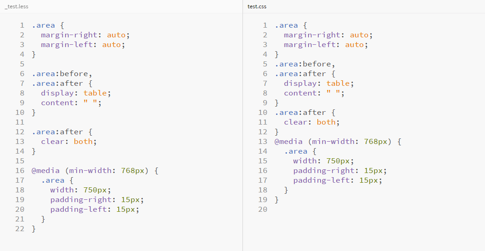

# Грань между Less и CSS

Если попытаться напрячь своё воображение и не вдаваться в подробности, то окажется, что вы уже используете препроцессор Less, хотя и косвенно. Да, это не шутка. Любой CSS-файл считается валидным Less-файлом. Для этого даже не нужно менять расширение файла. Однако, такое положение дел возможно, если вы подключаете этот файл к другому файлу, который уже имеет расширение `.less` или работаете с консолью. О том, как работать с файлами в Less я буду говорить позднее, а вот пример валидного Less-файла я обязательно приведу для большего понимания темы.

Ниже приведён фрагмент самого обычного CSS-кода, который я использую у себя в проектах. Весь этот код хранится в файле `styles.css` вместе с сотнями других строчек, но нас интересует именно синтаксис, а не файл и его содержимое.

```css
.area {
  margin-right: auto;
  margin-left: auto;
}

.area:before,
.area:after {
  display: table;
  content: " ";
}

.area:after {
  clear: both;
}

@media (min-width: 768px) {
  .area {
    width: 750px;
    padding-right: 15px;
    padding-left: 15px;
  }
}
```

Я думаю объяснять не стоит, что здесь мы имеем дело с обычным CSS. На этом этапе нам не важно, что и как делают эти строчки, главное, что они реальны и могут использоваться в любом CSS-файле уже сейчас.

А теперь возьмём эти стили и, ничего не меняя, поместим их в файл с таким же именем, но имеющим расширение `.less`. Я понимаю, что до сих пор мы не рассматривали возможность компиляции less-файлов, но поверьте мне на слово — файл скомпилируется без ошибок и будет точно таким же по содержанию.



На изображении выше представлено состояние less-файла до компиляции и после. Сразу видно, что они идентичны и различаются лишь наличием пустых строк после селекторов в Less-файле, а также расширением.

Из всего этого напрашивается вывод, что даже если вы не будете использовать возможности Less полностью или будете пользоваться лишь некоторыми из них, то ничего страшного не случится. Вас никто не обязывает менять свой любимый синтаксис на какой-либо другой. Наоборот, препроцессор Less будет только рад этому, ведь в таком случае на компиляцию уйдёт меньше времени. Если говорить ещё проще, то препроцессор можно применять лишь для конкретных целей, например, для построения удобной и хорошо поддерживаемой структуры, которую можно организовать и на чистом CSS, но с меньшим удобством.

О структуре проекта я подробнее расскажу ближе к концу этой удивительной истории, когда к вам, по идее, придёт понимание того, чем вы занимались на протяжении всего времени, проведённого с этой книгой. Поэтому не волнуйтесь — всему своё время.
